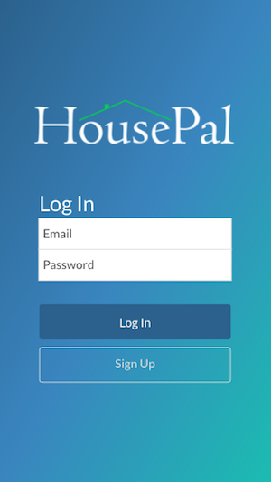
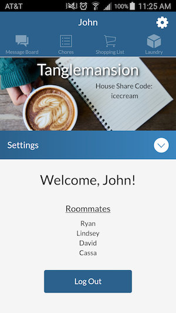
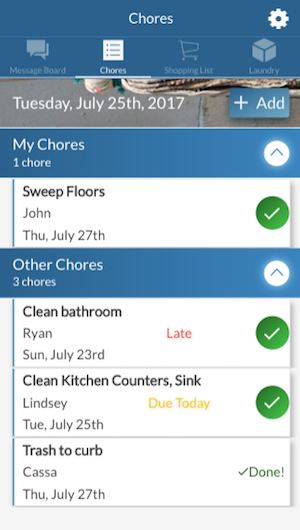
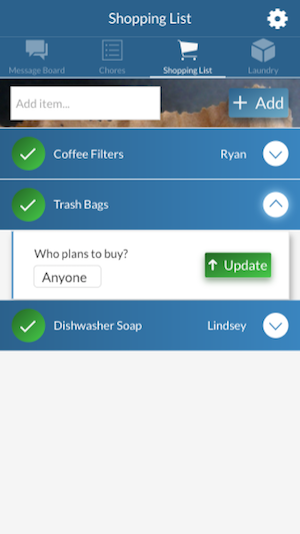
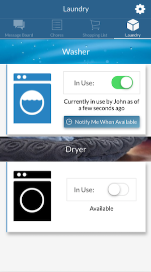
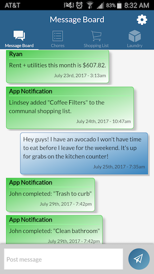

HousePal
=====================

*I am currently in progress cleaning up and refactoring the code for this project*
HousePal is a mobile app developed for Android designed to make communal living easier for people living with roommates and in shared/communal houses. It has a chore cycle, communal shopping list, and laundry tracker - all in one place.

HousePal is a mobile app developed for Android | July 2017


## Features
 | 

#### Chore Cycle


#### Communal Shopping List


#### Laundry Tracker


#### Message Board


## Installation

The repository can be downloaded and run as a web application for development/testing:

1. Run npm install to download necessary dependencies.
2. Make sure Ionic v1 is installed: http://ionicframework.com/getting-started
3. In the terminal, use Ionic to run the application:
```
$ ionic serve
```

Native mobile downloads of the app (for Android) are currently only available with beta test versions in the Google Play store.

## API Back-end

HousePal API (back-end):
-https://github.com/andromeda111/housepal-api

## Technology
Front:
AngularJS, Ionic v1, Cordova, JavaScript, HTML5/CSS3/Sass

Server and Database:
Node.js, ExpressJS, PostgreSQL, Knex.js, Passport

Services:
Google Firebase Cloud Messaging, Heroku

## Developed By | July 2017:

John Seymour: https://github.com/andromeda111
Email: jmseymour111@gmail.com
